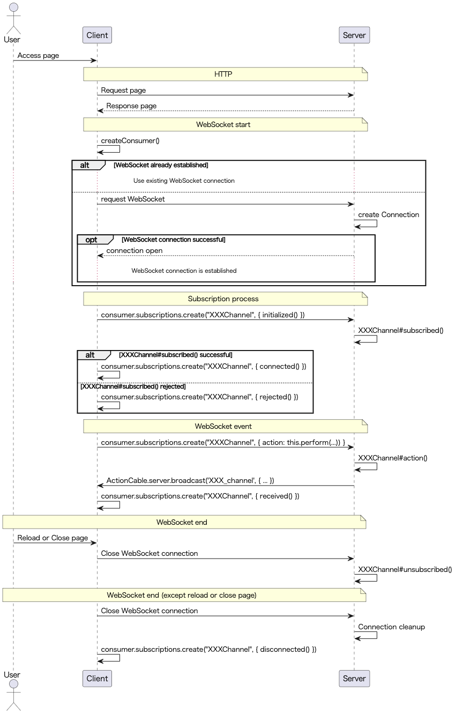

## Action Cableによるリアルタイム通信

WebSocketを使ったリアルタイム処理を提供するライブラリです。


### WebSocketとは？

クライアント/サーバー間のコネクションを通信終了時に毎度終了しないで、お互いにデータをやり取りするための通信規格です。


### 実装方法


#### Action Cable用のファイルを作成する

```
rails g channel xxx yyy
=> invoke  test_unit
create    test/channels/xxx_channel_test.rb
create  app/channels/xxx_channel.rb
identical  app/javascript/channels/index.js
identical  app/javascript/channels/consumer.js
create  app/javascript/channels/xxx_channel.js
```

`app/channels/xxx_channel.rb`と`app/javascript/channels/xxx_channel.js`がサーバーサイドとクライアントサイドを受け持つファイルになります。

`app/channels/xxx_channel.rb`はコントローラーのような役割を果たします。そのため、ビジネスロジックはこちらに記載してください。

クライアントは、Railsが提供しているコンシューマーからインスタンスを作成して、WebSocket通信の疎通のため動きます。

コンシューマーが作成したWebSocket通信の疎通完了後、RailsによってWebSocket通信経路に対応して**コネクション**が1つだけ作成されます。<br>コネクションはあなたの情報を持っています。認証情報などはこちらで保管します。<br>また、1つのWebSocket通信には、1つのコネクションしか作成できません。

コネクションを所持しているあなたは、特定の**チャンネル**の購読(サブスクリプション)を行う事ができます。

クライアントは1度コネクションを確立すると、この経路を使って複数のチャンネルを購読することができます。

~~~~Ruby
class XXXChannel < ApplicationCable::Channel
  def subscribed
    # コンシューマーが購読したいチャンネルを初期化した時に呼び出されます。
    # チャンネルを購読できるようにする処理を書きます
    # stream_from :xxx_channel

    # stream_fromは、引数のチャンネルに何かがbroadcastされた場合
    # JS側のsubscriptionsがrecievedできるように設定しています。
  end

  def unsubscribed
    # クライアントとのリアルタイム通信を切断した時に呼び出す処理を記述します。
    # ページリロードや、ページ離脱も処理のイベント対象内になります。
  end

  def yyy
    # 特定の処理を定義できます。
    # 一般的には、以下のようにして、購読者に送信を行う処理などを記述します。
    # ActionCable.server.broadcast('xxx_channel', { ... })

    # broadcastは、引数で指定したチャンネルを購読しているチャネルにおけるユーザーのsubscriptionのreceivedが発火します。
  end
end
~~~~

~~~~JavaScript
import { createConsumer } from "@rails/actioncable"

// アプリケーションロード時に1度だけ読み込まれ、consumerインスタンスを作成します。
// consumerインスタンスを作成して、WebSocket通信の確立をサーバー側に依頼します。
// サーバー側が承認すれば、コネクションが確立します。
export default createConsumer()
~~~~

~~~~JavaScript
import consumer from "./consumer"

consumer.subscriptions.create("XXXChannel", {
  initialized() {
    // こちらのインスタンスが初期化される時に呼び出されます。
  },

  connected() {
    // Rails側が購読予定のチャンネルにおける`subscribed`を実行し、購読に成功した場合に呼び出されます。
  },

  disconnected() {
    // サーバーとの接続が終了した時に呼び出される処理を記述します。
    // サーバー側が落ちた時や、意図的にチャンネルを切断した場合に発火します。(ページリロード、ページタブ削除の場合は、ブラウザのJSが無効化するため、発火しません)
  },

  received(data) {
    // Rails側からこちらのチャンネルに対してbroadcastされた場合に呼び出されます。
  },

  yyy: function() {
    // performに引数を指定することで、Rails側の対応するチャネルにおいて、対応するメソッドが呼び出されます。
    return this.perform('yyy');
  }
});
~~~~

対象のサーバーと疎通が確認されたときに、コネクションを確立しようとします。よってsubscriptionのインスタンス作成の手前で条件分岐を書かなければconnectedは勝手に繋がってしまうので、注意してください。

シーケンスは以下になります。




### アダプタの設定

`config/cable.yml`にて設定を行う事ができます。

asyncアダプターを本番環境で立ち上げるとプロセス間での情報接続ができないため、ブロードキャストがうまく行かない場合があります。

本番環境の運用を行う場合には、WebSocket用のサーバーとWeb用サーバーを分離して、WebSocketだけでも動作させるには工夫が必要です。

> サーバーにも向き不向きがあります。また、セキュリティの問題でもそれぞれの対策を集中できるため一般的には分離し、WebSocketだけで動作するようにします。(スタンドアロン)

Rackアプリケーションとして、独立したサーバープロセスで立ち上げたい場合、以下のファイルを作成します。

~~~~Ruby
# cable/config.ru

require_relative "../config/environment"
Rails.application.eager_load!

run ActionCable.server
~~~~

pumaで立ち上げますが、Docker管理の場合はコンテナを別で立てる必要があります。そのためDockerfile、およびdocker-compose.ymlの編集を行ってください。

~~~~Ruby
# Mount Action Cable outside main process or domain.

# デフォルトの設定では、ActionCableがWeb用のサーバーにマウントされているため、解除する必要があります。
config.action_cable.mount_path = nil
# ActionCableの接続先を変更する必要があります。(適宜ドメインを変更する必要があります。)
config.action_cable.url = 'wss://example.com/cable'
# ActionCableへの接続を許しているオリジンを設定します。(適宜ドメインを変更する必要があります。)
config.action_cable.allowed_request_origins = [ 'http://example.com', /http:\/\/example.*/ ]
~~~~

設定をクライアントサイドに反映させるために、`app/views/layouts/application.html.erb`に以下を追記してください。挿入の順序がありますので、注意してください。

~~~~Html
<%= csrf_meta_tags %>
<%= csp_meta_tag %>
<!-- meta_tagの下、かつpack_tag, link_tagよりも上に記載してください。 -->
<%= action_cable_meta_tag %> 

<%= stylesheet_link_tag 'application', media: 'all', 'data-turbolinks-track': 'reload' %>
<%= javascript_pack_tag 'application', 'data-turbolinks-track': 'reload' %>
~~~~


### 認証ありきでのActionCable

前提として、cookieで認証情報を管理します。

以下を`app/channels/application_cable/connection.rb`に記載してください。

~~~~Ruby
module ApplicationCable
  class Connection < ActionCable::Connection::Base
    identified_by :current_user

    def connect
      self.current_user = find_verified_user
    end

    private

    def find_verified_user
      if verified_user = User.find_by(id: cookies.signed[:user_id])
        verified_user
      else
        reject_unauthorized_connection
      end
    end
  end
end
~~~~


### ワーカー数の設定

WebSocketで受け取るメッセージは、ActionCable用のワーカースレッドで処理します。これは、メインタスクとは独立して動いているという認識をしてもらえればOKです。

デフォルトでは4つのワーカースレッドが動作しているのですが、ワーカー数を設定する事ができます。

増やせば増やすだけ、処理の効率は上がりますが、費用も上がりますので、その辺りを検討してください。

ワーカー数を変更する場合は、以下のファイルの編集をしてください。

| ファイル名 | 詳細 |
| -- | -- |
| `config/environments/productuion.rb` | config.action_cable.worker_pool_size |
| `config/database.yml` | WebサーバーとActionCableのサーバーが同一の場合<br>Web用のスレッド数と上記で設定するActionCableのスレッド数の和<br><br>スタンドアロンでの起動<br>それぞれのスレッド数、もしくはそれ以上 |


### テスト方法

テストファイルは`test/channels`というディレクトリがあるので、そちらに配置してください。


#### チャネルテスト

~~~~Ruby
require 'test_helper'

class XXXChannelTest < ActionCable::Channel::TestCase
  test 'subscribes' do
    # チャンネルを購読します。
    subscribe

    # ファイル名に対応したチャンネルを正しく購読できているのか確認します。
    assert subscription.confirmed?

    # チャンネルが作成されているかどうかの確認をします。
    assert_has_stream 'xxx_channel'
  end

  test 'broadcast' do
    subscribe

    text = 'dummy'
    broadcast_text = ApplicationController.render(
      partial: 'messages/message',
      locals: { message: Message.new(content: text) }
    )
    # ブロードキャスト用のメソッド
    assert_broadcast_on('xxx_channel', mesage: broadcast_text) do
      perform :yyy, message: text
    end
  end
end
~~~~


#### コネクションテスト

~~~~Ruby
require 'test_helper'

class ApplicationCable::ConnectionTest < ActionCable::Connection::TestCase
  test 'connection accepts' do
    ...
  end

  test 'connection rejects' do
    ...
  end
end
~~~~

コネクションで定義したインスタンス変数が呼び出すことができればOKです。認証エラーとなるテストも忘れないように加えておきましょう。
